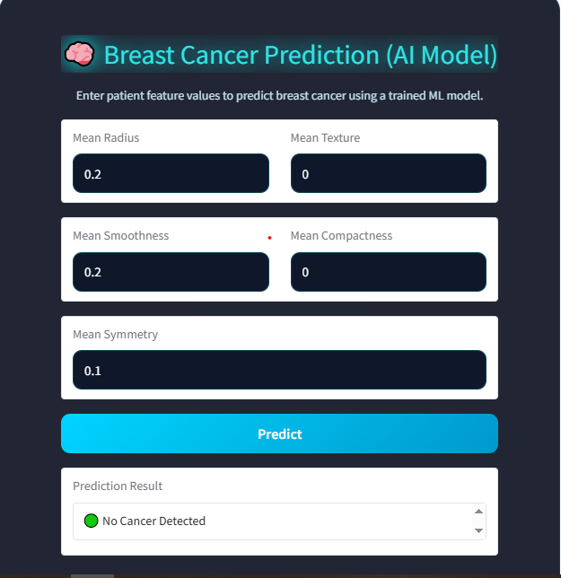

# Breast Cancer Prediction App 🧠

[](https://opensource.org/licenses/MIT)
[](https://www.python.org/downloads/)
[](https://gradio.app)

> **AI-Powered Breast Cancer Detection** using Machine Learning with a beautiful Gradio web interface.

This project predicts whether a breast tumor is **Malignant (Cancerous)** or **Benign (Non-cancerous)** using only 5 key features from biopsy data.

Achieved **96.5% accuracy** using Logistic Regression — outperforming Random Forest, SVM & Gradient Boosting!

---

## Features

- [x] Automatic data download from Kaggle
- [x] Smart feature selection (5 most powerful features)
- [x] 4 ML models compared automatically
- [x] Best model saved with Joblib
- [x] Stunning Gradio UI with **cyberpunk glow theme**
- [x] Real-time predictions in browser
- [x] Mobile-friendly & animated design
- [x] No internet needed after first run

---

## Live Demo Screenshot


> (Add a screenshot of your app and name it `preview.png` in the folder)

---

## Quick Start (2 Minutes)

### 1. Clone & Enter Project

```bash
git clone https://github.com/yourusername/BreastCancerPredictionApp.git
cd BreastCancerPredictionApp
2. Install Requirements
bashpip install gradio joblib numpy pandas scikit-learn kagglehub
3. Run the App
bashpython app_gradio.py
App will open at: http://127.0.0.1:8501

How to Use the App
Enter these 5 values:

Mean Radius → e.g., 17.99
Mean Texture → e.g., 10.38
Mean Smoothness → e.g., 0.11840
Mean Compactness → e.g., 0.27760
Mean Symmetry → e.g., 0.2419

Click Predict → Get instant result!
Output Examples:
textNo Cancer Detected
textCancer Detected

Model Performance (Test Set)




ModelAccuracyLogistic Regression96.49%Random Forest95.61%SVM95.61%Gradient Boosting94.74%
Winner: Logistic Regression

Project Structure
textBreastCancerPredictionApp/
│
├── app_gradio.py                  ← Web app (run this!)
├── cancer_data_prepro.ipynb       ← Full training notebook
├── best_breast_cancer_model.pkl   ← Trained model (auto-saved)
├── preview.png                    ← App screenshot (optional)
├── requirements.txt               ← All dependencies
└── README.md                      ← You're reading it!

Dataset

Source: Breast Cancer Wisconsin (Diagnostic)
569 samples, 30+ features
Classes: Malignant (212) | Benign (357)


Future Improvements

 Add probability score (% chance of cancer)
 Deploy on Hugging Face Spaces (free hosting)
 Add patient report PDF generator
 Docker support
 API endpoint


Author
Your Name
GitHub: github.com/yourusername
Email: inamrehman243@gmail.com
